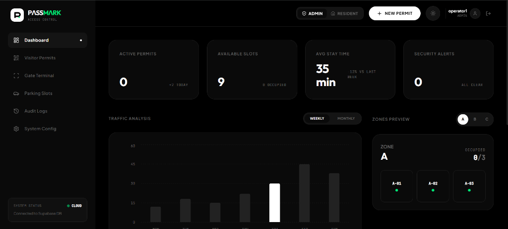
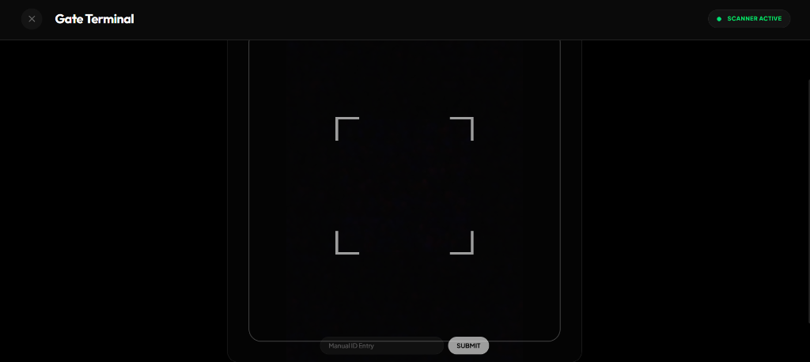
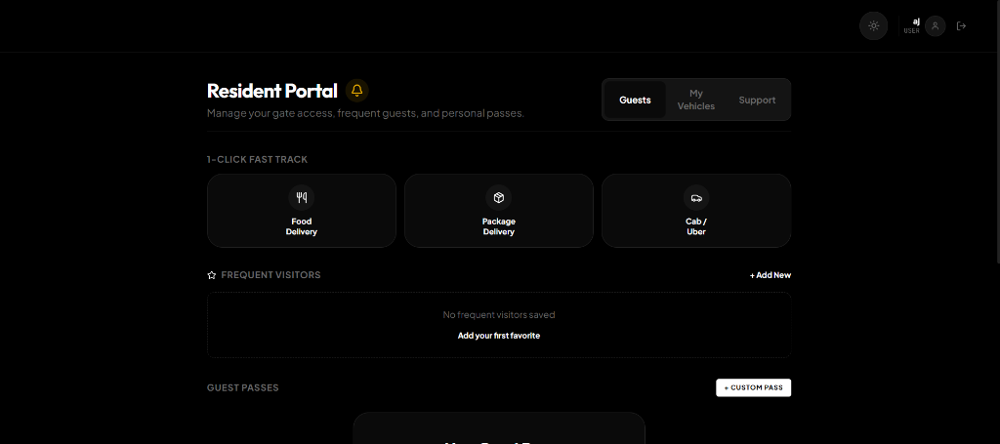
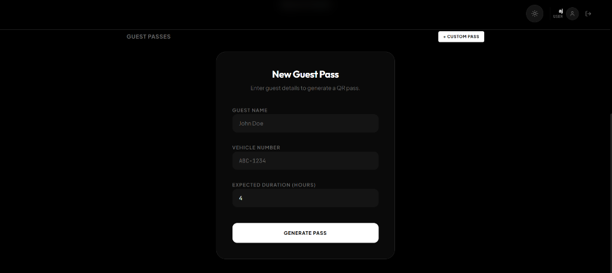

   

# PASSMARK

> A modern, minimalist digital parking management and QR access control system designed for gated residential communities and commercial facilities.

PASSMARK streamlines gate security, visitor pre-registration, and real-time parking inventory tracking. It provides a dual-interface architecture tailored for both **Residents** (quick pass generation, vehicle registration, and frequent guest management) and **Security Operators** (live QR scanning terminal, slot allocation, occupancy tracking, and security overstay detection).

---

## Preview

<table>
  <tr>
    <td width="50%" align="center">
      <br />
      <sub><b>Admin Dashboard</b> — live occupancy, traffic analysis, and zone monitoring</sub>
    </td>
    <td width="50%" align="center">
      <br />
      <sub><b>Gate Terminal</b> — QR scanner for check-in/check-out</sub>
    </td>
  </tr>
  <tr>
    <td width="50%" align="center">
      <br />
      <sub><b>Resident Portal</b> — fast-track passes and guest management</sub>
    </td>
    <td width="50%" align="center">
      <br />
      <sub><b>Guest Pass Generation</b> — create time-bound QR passes</sub>
    </td>
  </tr>
</table>

---

## Key Features

### 🏢 Resident Portal
- **1-Click Fast-Track**: Instant passes for deliveries (Food, Courier) and taxi cabs.
- **Frequent Visitors / Favorites**: Save regular guests or staff for one-tap pass issuance.
- **Personal Vehicle Management**: Register personal vehicles for permanent digital gate passes.
- **Guest Passes**: Generate custom time-bound QR passes with custom validity windows.
- **Arrival Notifications**: Live browser alerts when guests scan in at the gate.

### 🛡️ Operator & Security Terminal
- **Hardware & Camera QR Scanner**: Built-in camera scanner with visual alignment reticle and instant validation feedback.
- **Check-In & Check-Out**: Automated entry timestamping, slot assignment, and departure logging.
- **Overstay & Security Alerts**: Automatic visual alerts and status flags for vehicles exceeding allocated time.
- **Manual ID Entry**: Fallback numerical permit lookup when camera scanning is unavailable.

### 🚗 Real-Time Parking Inventory
- **Zone Management**: Visual slot layout divided across zones (A, B, C) with occupancy status.
- **Live Allocation**: Dynamic parking slot assignment on entry and release on checkout.
- **Force Release**: Operator controls to clear or reassign slots as needed.

### 📊 Audit Logs & System Management
- **Audit Event Stream**: Chronological event logs for entries, exits, and system actions.
- **CSV Data Export**: Export filtered security and audit records with a single click.
- **Resilient Offline Support**: Automatic fallback to local browser storage if database connectivity is unavailable.
- **Theme Switching**: Built-in Dark (OLED) and Light minimalist visual themes.

---

## Tech Stack

- **Frontend**: React 19, TypeScript, Vite
- **Styling**: Tailwind CSS v4, Custom CSS Design Tokens
- **Backend & Database**: Supabase (PostgreSQL, Realtime Subscriptions, Row Level Security)
- **UI & Animation**: Motion, Lucide React, Sonner Toast Notifications, Recharts
- **Scanning & Code Generation**: HTML5-QRCode, QRCode.react
- **PWA**: Vite PWA Plugin for standalone mobile and desktop installation

---

## Getting Started

### Prerequisites
- Node.js (v18 or higher recommended)
- npm or yarn

### Installation

1. **Clone the repository**:
   ```bash
   git clone https://github.com/VRAJ-0512/PASSMARK-System.git
   cd "PASSMARK SYSTEM"
   ```

2. **Install dependencies**:
   ```bash
   npm install
   ```

3. **Configure Environment Variables**:
   Create a `.env` file in the project root based on `.env.example`:
   ```bash
   cp .env.example .env
   ```
   Fill in your Supabase project credentials in `.env`:
   ```dotenv
   VITE_SUPABASE_URL=https://your-supabase-project.supabase.co
   VITE_SUPABASE_ANON_KEY=your_supabase_anon_key
   ```
   *(Refer to `.env.example` for all supported configuration keys).*

4. **Database Setup (Optional / Supabase)**:
   If using Supabase, execute the SQL migration script located at `supabase/schema.sql` in your Supabase SQL Editor to initialize tables, row-level security, and realtime subscriptions.

5. **Start the Development Server**:
   ```bash
   npm run dev
   ```
   The application will be running at `http://localhost:3000/`.

---

## Available Scripts

- `npm run dev` — Starts the local Vite development server.
- `npm run build` — Bundles the production application into `dist/`.
- `npm run preview` — Locally previews the production build.
- `npm run lint` — Runs TypeScript compiler checks (`tsc --noEmit`).

---

## Project Structure

```
PASSMARK SYSTEM/
├── public/                 # Static assets & PWA manifest icons
├── src/
│   ├── components/         # Presentation & UI components
│   │   ├── common/         # Reusable primitives (Brand, StatCard, StatusBadge)
│   │   ├── layout/         # Header and Sidebar navigation
│   │   ├── modals/         # New Permit and QR Display modals
│   │   ├── scanner/        # Camera QR scanner wrapper
│   │   └── views/          # Primary views (Dashboard, Gate, Permits, Resident, etc.)
│   ├── hooks/              # Custom hooks (useAuth, usePassmarkData, useTheme)
│   ├── lib/                # Supabase client singleton & configuration
│   ├── types/              # TypeScript interfaces and declarations
│   ├── utils/              # Helper utilities (date formatting, CSV export)
│   ├── App.tsx             # Root application coordinator
│   ├── index.css           # Design tokens, theme variables & animations
│   └── main.tsx            # React application entry point
├── supabase/
│   └── schema.sql          # Database schema, RLS policies, and triggers
├── .env.example            # Environment variables template
├── .gitignore              # Git ignore rules
├── package.json            # Dependencies and build scripts
└── vite.config.ts          # Vite build and PWA configuration
```

---

## Author

Built by Vraj Mistry — [GitHub profile](https://github.com/VRAJ-0512)
